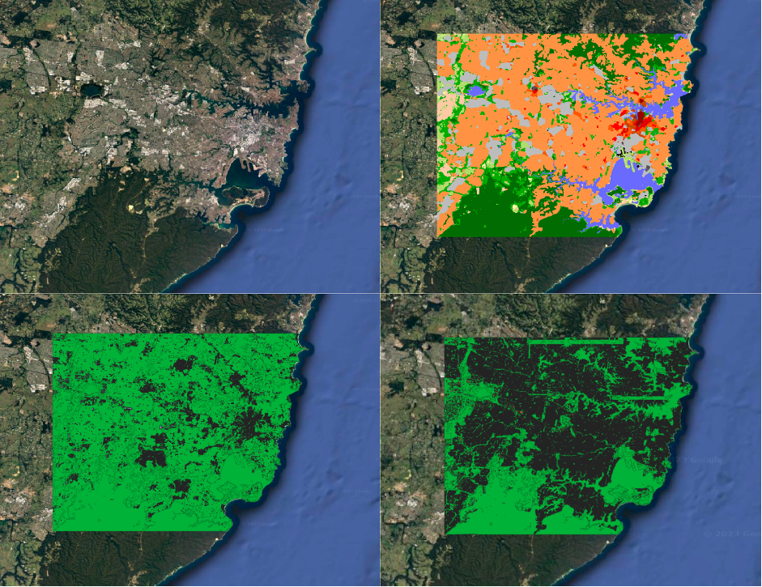
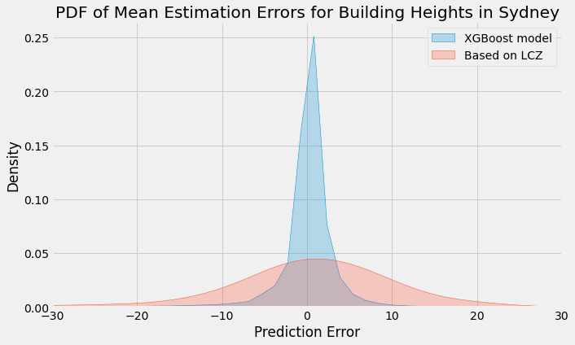

## Enhancing Urban Meteorology: A Machine Learning Approach for Accurate Building Height Estimation
# Introduction

Urban meteorology studies are essential for understanding and predicting complex weather patterns and climate dynamics in urban environments. Precise urban morphology data is crucial due to the significant impact of urban structures on local weather and climate. Building heights, layouts, and distribution directly influence factors like temperature, wind flow, and precipitation, making them vital components of urban meteorological models.

Obtaining building data is challenging due to data availability, quality, privacy, cost, and integration issues. Building data can be accessed from sources like OpenStreetMap (OSM), Microsoft Building Footprints, Google Maps, government platforms, and local municipal open data portals.

This document outlines a novel methodology for estimating building heights from a machine learning approach, primarily for urban climate and weather research but also applicable to urban planning.

The study demonstrates the potential of this approach in improving height estimations compared to traditional methods based solely on local climate zones. Future work may involve extending this methodology to multiple cities and integrating it into existing meteorological modeling frameworks.

# Methodology

## 1. Data Collection

We source building data from two primary providers: OpenStreetMaps (OSM) and the Microsoft Building Footprints API, each contributing distinct attributes.

### OpenStreetMaps (OSM)

- Provides detailed height information for buildings.
- Lacks comprehensive building data, particularly in terms of coverage.

### Microsoft Building Footprints (MBF)

- Offers extensive building footprints, covering a larger number of buildings.
- Lacks specific building height information.

The combination of these data sources bridges their individual gaps, allowing us to harness the advantages of both.

## 2. Domain of Study

The experiment is placed in Sydney, serving also as the motivator for this study. Figure 1 depicts a selected domain of 50km by 40km. The top-left section showcases the entire Sydney metropolis, while the top-right displays the study domain with the local climate zone map. In this region, OSM data provides a comprehensive building dataset (bottom left), including geometry and height information, covering only around 30% of the buildings present in the MBF dataset (bottom right). Comapred to the 600,000 buildings footprints in MBF dataset, there are only 200,000 in OSM with height data, constituting only a third of the dataset.

**Figure 1**: Domain chosen of sidney 50km east to west and 40km north to south. 

Two experiments have been conducted, one using data solely from the Sydney domain (around 180,000 buildings) and the other including a similar-sized domain in Grenoble (approximately 200,000 buildings), which significantly enhanced the model's performance.

## 3. Model and Approach Comparison

Our methodology involves comparing two approaches for building height estimation.

### Local Climate Zones Approach

In the conventional approach, building heights are estimated by assigning a single, average value to each building based on its specific local climate zone, in accordance with the values provided in the WUDAPT project's tables.

### XGBoost Model

We employ an XGBoost machine learning model, utilizing features such as building area, perimeter, and location (latitude and longitude) to predict building heights. The first experiment is conducted on a training set of 140,000 buildings for Sydney, and for the second experiment, the set is extended with 200,000 buildings from the Grenoble area, making a total of 340,000.

The evaluation of both methods is done on a test sample of 40,000 buildings. By evaluating the accuracy and effectiveness of the XGBoost model against the local climate zones approach, we determine the most reliable and accurate approach for building height estimation for urban climate modeling purposes.

# Results

The results from both approaches are shown in Table 1. The LCZ approach estimates building height with a MAE of 8.5 m, the XGBoost first experiment shows an MAE of 5.3 m, and the XGBoost second experiment an MAE of 2.3 m.

| Approach                   | Train Sample Size | Test Sample Size | MAE (meters) |
|----------------------------|-------------------|------------------|--------------|
| LCZ Approach               | N/A               | 40,000              | 8.5          |
| XGBoost (First Experiment) | 140,000           | 40,000           | 5.3          |
| XGBoost (Second Experiment)| 340,000           | 40,000           | 2.3          |

The results of table 1 show a clear ingcrease in performance of the machine learning approach compared to the LCZ approach, from 8.5 meters down to 5.3 meters of MAE. This is further improved when using the larger dataset including the buildings of Grenoble area, bringing the MAE down to 2.3 meters. 

Figure 2 compares error distributions between the LCZ approach and XGBoost's second experiment. The LCZ approach has a higher standard deviation (18.97 meters), indicating more varied height estimation errors. In contrast, XGBoost's second experiment has a lower standard deviation (5.58 meters) and a narrower error range (-2.5 to 2.75 meters), suggesting more consistent and accurate height estimations.

**Figure 2**: Probability Density Function (PDF) of Mean Estimation Errors for Building Heights in Sydney - LCZ Approach vs. XGBoost Approach (Experiment 2)

| Statistic                | XGBoost (2) | LCZ  |
|--------------------------|-------------|------|
| Mean                     | -0.02       | -1.75 |
| Standard Deviation       | 5.58        | 18.97 |
| 10th Percentile          | -2.5        | -12.1 |
| 90th Percentile          | 2.75        | 11.0  |

"Table 1: Mean and Standard Deviation of Building Height Estimation Errors - XGBoost (Experiment 2) vs. LCZ Approach"

**Conclusion:**

In summary, this study presents promising results, with the machine learning approach demonstrating its superiority over the conventional LCZ method in building height estimation for urban climate modeling. Notably, the XGBoost model achieves a significantly lower Mean Absolute Error (MAE) of 2.3 meters compared to the LCZ's 8.5 meters. It is important to note that this is a preliminary model that can be further improved by incorporating additional features, such as LCZ data for each building, area code, vegetation in the area, and other relevant factors.

**Future Study:**

Further research is essential to explore the impact of this method on grid cell statistics for meteorological applications. Evaluating its alignment with the WRF plus building energy model (BEP+BEM), which relies on statistical information within grid cells rather than detailed building data, will provide a deeper understanding of the method's compatibility with broader meteorological applications.
